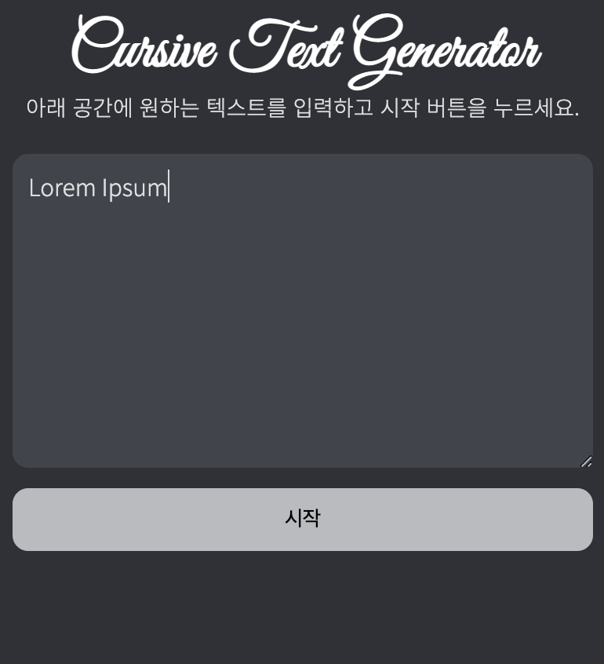
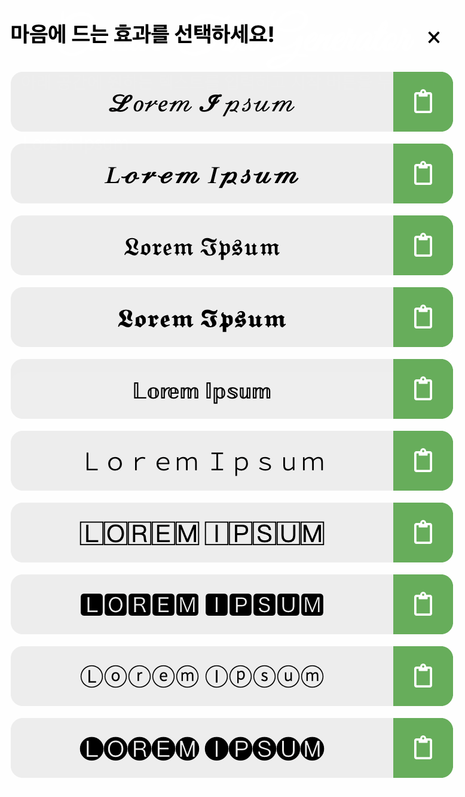

# 𝓒𝓤𝓡𝓢𝓘𝓥𝓔
Write Cursive Text Easily Using the CURSIVE Browser Extension.

## Installation
The CURSIVE browser extension is currently available for NAVER Whale.

[Download From NAVER Whale Store](https://store.whale.naver.com/detail/nbhhoniajhjilfijhkcebgigcmidlpcp)

## Usage
The extension logo (marked as a cursive 'C') will appear on your browser toolbar, or the sidebar, depending on which browser you use. Clicking on the icon will open it.

Enter any text into the text input and press 'start'.

The converted results will appear. Press the clipboard button to copy them.

## License

Copyright 2021 Jongwoo Lee

Permission is hereby granted, free of charge, to any person obtaining a copy of this software and associated documentation files (the "Software"), to deal in the Software without restriction, including without limitation the rights to use, copy, modify, merge, publish, distribute, sublicense, and/or sell copies of the Software, and to permit persons to whom the Software is furnished to do so, subject to the following conditions:

The above copyright notice and this permission notice shall be included in all copies or substantial portions of the Software.

THE SOFTWARE IS PROVIDED "AS IS", WITHOUT WARRANTY OF ANY KIND, EXPRESS OR IMPLIED, INCLUDING BUT NOT LIMITED TO THE WARRANTIES OF MERCHANTABILITY, FITNESS FOR A PARTICULAR PURPOSE AND NONINFRINGEMENT. IN NO EVENT SHALL THE AUTHORS OR COPYRIGHT HOLDERS BE LIABLE FOR ANY CLAIM, DAMAGES OR OTHER LIABILITY, WHETHER IN AN ACTION OF CONTRACT, TORT OR OTHERWISE, ARISING FROM, OUT OF OR IN CONNECTION WITH THE SOFTWARE OR THE USE OR OTHER DEALINGS IN THE SOFTWARE.
